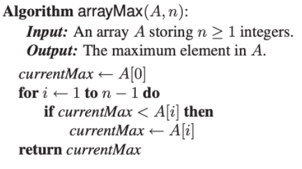
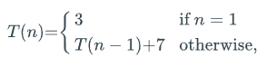
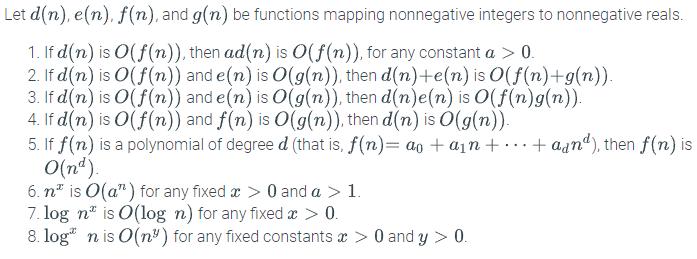
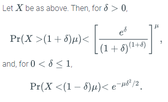

# Chapter 01: Algorithm Analysis

## Introduction

**Scalability**: system's ability to accommodate growing workloads

**Algorithm**: step-by-step procedure for performing a task in a finite amount of time. Important metrics are **running time** and **space usage** 

**Data structure**: systematic way of organizing and accessing data

## Analyzing Algorithms

Algorithms are generally measured by examining the effect of their input size on their running time. Because of the limited ability to measure all inputs, experimental studies are not enough to measure algorithms. An analytical methodology is used that provides for high-level evaluation of algorithms that is independent from specific hardware and software environments

This methodology represents algorithms as a function $f(n)$, characterizing running time in terms of input size $n$. Statements are also used to describe this, such as "Algorithm $A$ runs in time proportional to $n$"

**Pseudocode** is used to represent algorithms in an easily comprehensible manner: 

**Primitive operations** represent operations that are independent from a specific programming language. They are used for high-level analysis of algorithms and are included in pseudocode. The number of primitive operations that an algorithm performs, $t$, is proportional to that algorithm's actual running time. These operations may be the following: 

- assigning a value to a variable
- arithmetic operations
- array indexing
- calling a method
- comparing two numbers
- following an object reference
- returning from a method

An algorithm's running time varies based on inputs. Therefore, it may be useful to express the average time taken across all possible inputs. However, this requires extensive mathematical computation to discover, so algorithms are commonly characterized by their **worst case** running time

### Recursive Algorithms

Analyzing recursive algorithms requires the use of **recurrence equations**. These define the mathematical statements that the running time must satisfy. This uses a function labeled $T(n)$ and contains equations that this function must satisfy that are modelled after the states of the algorithm (e.g., if the recursive base case is satisfied). An example illustrates the recursive maximum array value function below:

Recurrence equations are ideally characterized in **closed form**, meaning that there are no references to $T$ on the right-hand side

### Asymptotic Notation

This notation allows characterization of the main factors affecting an algorithm's running time without going into all the details of primitive operations

### O(x)

The "**big-Oh**" notation consists of the following: $f(n)$ is $O(g(n))$ if there is a real constant $c > 0$ and an integer constant $n_0 \geq 1$ such that $f(n) \leq cg(n)$ for every integer $n \geq n_0$, pronounced as "$f(n)$ is **order** $g(n)$". In essence, this states that a function of $n$ is less than or equal to another function up to a constant factor as $n$ grows to infinity

This notation is simplified by a set of rules: 

Algorithms are expressed in their simplest terms, meaning that $f(n) = 4n^3 + 3n^{4/3}$ is $O(n^3)$

"Big-Oh" is expressed using the following notation: $f(n) \in O(g(n))$

Additionally, it may also be expressed as "$f(n)$ is $g(n) + O(h(n))$, meaning that there are constants
$c > 0$ and $n_0 \geq 1$ such that $f(n) \leq g(n) + ch(n)$ for $n \geq n_0$

### $\Omega(x)$

Similar to "big-Oh", "big-Omega" ($\Omega$) characterizes the minimum running time of an algorithm. It is represented by the equation $f(n) \geq cg(n)$ for $n \geq n_0$

### $\Theta(x)$

"Big-Theta" ($\Theta$) is used when $f(n)$ is both $O(g(n))$ and $\Omega(g(n))$. There are real constants $c' > 0$ and $c'' > 0$ and an integer constant $n_0 \geq 0$ such that $c'g(n) \leq f(n) \leq c''g(n)$ for $n \geq n_0$

### $o(x)$ and $\omega(x)$ 

"Little-Oh" and "Little-Omega" state that one function is strictly less than or strictly greater than another asymptotically. They are not used often

### Asymptotic Efficiency

Asymptotic notation may be misleading should the constant factors they "hide" be very large. Examples are: 

- $\Theta(n)$ is faster than $\Theta(\log n)$ when $n < 10000$
- $10n \log n$ is faster than $10^{100}n$

"Efficient" algorithms are typically those that run in polynomial time ($O(n^2)$), whereas "inefficient" ones require exponential time ($\Theta(c^n)$). Like above, exceptions still apply, as for example $\Theta(n^{100})$ is not efficient

Function classes are ordered according to their growth rates, with **asymptotically  better** functions being ranked higher: 

| Function   | Common Name     |
| ---------- | --------------- |
| $\log n$   | logarithmic     |
| $\log^2 n$ | polylogarithmic |
| $\sqrt n$  | square root     |
| $n$        | linear          |
| $n \log n$ | linearithmic    |
| $n^2$      | quadratic       |
| $n^3$      | cubic           |
| $2^n$      | exponential     |

## Mathematical Review

### Summations

$$ \sum_{i=a}^bf(i) = f(a) + f(a+1) + ...+ f(b)  $$

Summations arise in algorithms due to the running times of loops

**Geometric** summations mean that each term is geometrically larger than the previous one if a > 1. An example is: 

$$ 1 + 2 + 4 + 8 + ... + 2^{n-1} = 2^n - 1$$ 

Gauss's Summation is another prominent example: 

$$ \sum_{i=1}^{n} i = 1 + 2 + 3 + ... + (n-2) + (n-1) + n = \frac{n(n+1)}{2}$$

### Logarithms and Exponents

$$ \log_ba = c \textrm{ if } a = b^c $$

Rules for logarithms and exponents are as follow:

Shorthand notation implies that: 

- $\log^cn = (\log n)^c$
- $\log \log n = \log(\log n)$

**Floor** and **ceiling** functions convert real-valued functions into integer-valued functions:

- $\lfloor x \rfloor$: largest integer less than or equal to x
- $\lceil x \rceil$: smallest integer greater than or equal to x 

### Simple Justification Techniques

Several ways exist to **prove** claims:

### Example

**Prove by Example**: produce a particular example to justify a claim, or a particular counterexample to disprove it 

### Contrapositives and Contradiction
  
**Contrapositive**: to  justify "if $p$ is true, then $q$ is true", instead establish that "if $q$ is not true, then $p$ is not true"
  
**DeMorgan's Law**: the negation of the statement "$p$ or $q$" is "not $p$ and not $q$", and the negation of "$p$ and $q$" is "not $p$ or not $q$"

**Contradiction**: establish that a statement $q$ is true by first supposing that $q$ is false and then showing that this assumption leads to a contradiction

### Induction

**Prove by Induction**: for any particular $n$, there is a finite step-by-step sequence of implications that starts with something true and leads to the truth about $n$

Show that for any particular $n \geq 1$, there is a finite sequence of implications that starts with something known to be true and leads to showing that $q(n)$ is true

First, show that $q(n)$ is true for a base case value (perhaps $n=1$) for some constant $k$. Then, justify that the inductive step is true for $n > k$, namely that "if $q(i)$ is true for $i < n$ then $q(n)$ is true". An example is: 

### Loop Invariants

**Loop Invariants**: to prove some statement $S$ about a loop is correct, define $S$ in terms of a series of smaller statements $S_0,S_1,...,S_k$ where:

1. the **initial** claim, $S_0$, is true before the loop begins
2. if $S_{i-1}$ is true before iteration $i$ begins, then one can show that $S_i$ will be true after iteration $i$ is over
3. the final statement, $S_k$, implies the statement $S$ that we wish to justify as being true

Take the arrayFind method: 

First, claim that at iteration $i$, $S_i:x$ is not equal to any of the first $i$ elements of $A$

This is true since there are no elements among the first 0 in $A$. At iteration $i$, if $x$ is equal to $A[i]$ then the index $i$ is returned. If this is not the case, then another element not equal to $x$ has been found and $i$ may be incremented, meaning that $S_i$ is true for this new value of $i$ for the beginning of the next iteration. If the while-loop terminates without returning an index, then $S_n$ is true as there are no elements equal to $x$ 

### Basic Probability

Probability is defined upon a **sample space** ($S$), with is the set of all possible outcomes

**Probability space**: $S$ together with a probability function $Pr$, that maps subsets of $S$ to real numbers in the interval $[0,1]$. Each subset $A$ of $S$ is called an **event**, and $Pr$ possesses the following basic properties to these events:

1. $Pr(\empty)=0$
2. $Pr(S) = 1$
3. $0 \leq Pr(A) \leq 1$, for any $A \subseteq S$
4. if $A, B \subseteq S$ and $A \cap B = \empty$, then $Pr(A \cup B) = Pr(A) + Pr(B)$

Two events $A$ and $B$ are **independent** if: 

$$ Pr(A \cap B) = Pr(A) \cdot Pr(B)$$ 

A collection of events $\{A_1, A_2, ..., A_n\}$ is **mutually independent** if: 

$$ Pr(A_{i_1} \cap A_{i_2} \cap ... \cap A_{i_k}) = Pr(A_{i_1})  Pr(A_{i_2}) ... Pr (A_{i_k}) $$ 

for any sub set $\{A_{i_1}, A_{i_2}, ..., A_{i_k}\}$ 

### Conditional Probability

$A$ occurs given $B$ is denoted as $Pr(A | B)$ and is defined as: 

$$ Pr(A | B) = \frac{Pr(A \cap B)}{Pr(B)} $$

assuming that $Pr(B) > 0$

### Random Variables

A random variable is a function $X$ that maps outcomes from some sample space $S$ to real numbers. An **indicator random variable** is a random variable that maps outcomes to the set ${0, 1}$. An $X$ that has a discrete set of possible outcomes is used to characterize the running time of a randomized algorithm. The **expected value** of a discrete random variable $X$ is defined as: 

$$ E(x) = \sum_xxPr(X = x) $$

where the summation is defined over the range of X

Two random variables $X$ and $Y$ are **independent** if:

$$ Pr(X = x | Y = y) = Pr(X = x)$$

for all real numbers $x$ and $y$

### Chernoff Bounds 

Used to bound the sum of a set of random variables

Let $X_1, X_2, ..., X_n$ be a set of mutually independent indicator random variables, such that each $X_i$ is 1 with some probability $p_i > 0$ and 0 otherwise. Let $X = \sum_{i=1}^nX_i$ be the sum of these random variables, and let $\mu$ denote the mean of $X$, that is $\mu = E(X) = \sum_{i=1}^np_i$ 

## Amortization

Amortization is used for understanding the running times of algorithms that have widely varying performance. Rather than focusing on each operation separately, amortization considers the interactions between all the operations by studying the running time of a set of these operations

**Clearable table**: simple data structure used in amortization. Stores a table of elements accessible via their indices, and supports two operations:

- add($e$): add element $e$ to the next available cell
- clear(): empty the table

Let $S$ be a clearable table with $n$ elements implemented by means of an array of a fixed size $n$. clear() takes $\Theta(n)$ time. While it is correct that the worst-case for this series of operations is $O(n^2)$ due to there potentially being $O(n)$ clear operations, when taking into account the interactions between operations the running time is actually $O(n)$: 

**Amortized running time** is the worst-case running time of the series of operations divided by the number of operations. The advantage of using this value is that it provides a robust average-case analysis without using probability

There are several methods for performing amortization: 

### Accounting Method

Uses credits and debits to track the running time of different operations in the series. A constant amount of computing time costs $1, and each primitive operation costs $1

There is flexibility in charing operations: operations that execute few primitives may be charged more, with the profit being used to support operations that use many primitives. This allows every operation in a series to be charged the same amount $a$ of money. This pricing model is known as an **amortization scheme**. Under this, each operation in a series has an amortized running time that is $O(a)$

### Potential Functions

This technique is based on an energy model. The structure is associated with $\Phi$, which represents the current energy state of the system. Each operation performed contributes the value of its amortized time to $\Phi$, but then extracts the value of time actually spent from $\Phi$. The purpose of this is to use the change in potential for the $i$th operation, $\Phi_i - \Phi_{i-1}$, to characterize the amortized time needed for that operation 

The actual running time of the $i$th operation is: 

$$ t_i' = t_i + \Phi_i - \Phi_{i-1} $$

which results in the amortized cost of that operation being the actual time spent plus the net drop in potential: 

$$ t_i = t_i' + \Phi_{i-1} - \Phi_i $$

This means that the total amortized time for performing $n$ operations is:

$$ T' = \sum_{i=1}^n t_i'\cdot $$

The total actual time can therefore be bounded as: 

$$ T = T' + \Phi_0 - \Phi_n$$

Based on this, so long as $\Phi_n \geq \Phi_0$, then $T \leq T'$, meaning that the actual time spent is no more than the amortized time. This entails that the amortized time to perform any operation on a clearable table is $O(1)$, and since $\Phi_i \geq \Phi_0$, for any $i \geq 1$, the actual time to perform $n$ operations on an initially empty table is $O(n)$

### Extendable Arrays

The simple array implementation of a clearable table is limited by either wasted space (if the array is too large) or crashing (if the array is too small). Therefore, extendable arrays are used to dynamically modify the size of the table 

