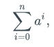
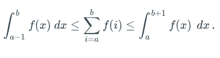

# Chapter 27: Useful Math

## Logarithms and Exponents

$\log_b a = c \textrm{ if } a = b^c$

$\textrm{If } a>0, b>0, \textrm{ and } c > a + b, \textrm{ then } \log a + \log b \leq 2\log c - 2$

### Identities

### Natural Logarithm

$\ln x = \log_e x; e = 2.71828...$

$e^x = 1 + \frac{x}{1!} + \frac{x^2}{2!} + ...$

$\ln(1+x) = x - \frac{x^2}{2!} + \frac{x^3}{3!} - \frac{x^4}{4!} + ...$

$\textrm{If } x>-1, \frac{x}{1+x} \leq \ln(1+x) \leq x$

$\textrm{For } 0\leq x < 1, 1 + x \leq e^x \leq \frac{1}{1-x}$

$\textrm{For any two positive real numbers x and n, } (1 + \frac{x}{n})^ n \leq e^x \leq (1 + \frac{x}{n})^{n + x/2}$

## Integer Functions and Relations

$\lfloor x \rfloor$: largest integer less than or equal to x

$\lceil x \rceil$: smallest integer greater than or equal to x 

**Modulo**: defined for integers $a \geq 0$ and $b > 0$ as: 

$a \mod b = a - \lfloor \frac{a}{b} \rfloor b$

**Factorial**: $n! = 1 \cdot 2 \cdot 3 ... (n-1)n$

### Binomial Coefficient

$(_k^n) = \frac{n!}{k!(n-k)!'}$

Number of different **combinations** possible by choosing $k$ different items from a collection of $n$

This derives the **binomial expansion**: 

$(a + b)^n = \sum_{k=0}^n (_k^n) a^kb^{n-k}$

$\textrm{If } 0 \leq k \leq n, \textrm{ then } (\frac{n}{k}^k) \leq (_k^n) \leq \frac{n^k}{k!}$

$n! = \sqrt{2\pi n} (\frac{n}{e}^n (1 + \frac{1}{12n} + \epsilon(n) \textrm{ where } \epsilon(n) \textrm{ is } O(1/n^2)$ (**Stirling's Approximation**)

### Fibonacci Progression

$F_0 = 0, F_1 = 1, F_n = F_{n-1} + F_{n-2} \textrm{ for } n \geq 2$

$\textrm{ If } F_n \textrm{ is defined by the Fibonacci progression, then } F_n \textrm{ is } \Theta(g^n), \textrm{ where } g = (1 + \sqrt{5})/2$ is the so-called **golden ratio**

## Summations

**Telescoping sum**: often arises in the amortized analysis of a data structure or algorithm

**Geometric sum**: for any fixed real number $0 < a\not ={1}$:

$n$th harmonic number $H_n$: $H_n = \sum_{i=1}^n \frac {1}{i}$

## Useful Techniques

### L'Hopital's Rule 

Used to determine if a function is little-oh or little-omega

### Summation Split

### Bound Summation by Integral

